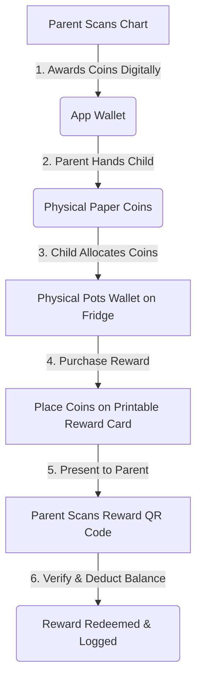
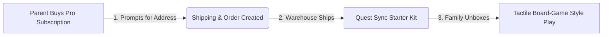

# Quest Sync — Physical-Digital Token Economy Plan

We are building a premium "Physical-Digital Hybrid Board Game" experience. This bridges the physical paper chore chart and the digital gamification (companions, pots, and rewards) using tactile printouts and smart QR code redemptions.

---

## 🗺️ System Overview

## 📄 Breakdown of Physical Printouts

### 🪙 Printout 1: The Quest Coins Sheet
A single-page printable containing rows of gold coins that the child cuts out.

* **What it contains:** 
  * Circular gold coins of five values: `1`, `5`, `10`, `20`, and `50`.
  * Dashed circular guides for easy cutting.
* **What it looks like:** 
  * Premium gold coin styling with high-contrast golden gradients, varying in size (1 is smallest, 50 is largest) with numbers printed in the center.
* **How it is used:** 
  * **1-Coins:** Used primarily for daily actions (e.g. child puts 1 coin in the Gifting or Food Pot pocket).
  * **5, 10, 20, 50-Coins:** Used for major savings milestones and placing on high-value Reward Cards.

---

### 🦖 Printout 2: The Fridge Companion Evolution Sheet
A full-page portrait poster that is taped to the center of the fridge or child's wall, showing their pet.

* **What it contains:** 
  * A large visual of the child's companion at their **current stage** (e.g., a dinosaur egg, a baby dragon, or a full grown dino) along with their name and level.
* **What it looks like:** 
  * A premium, border-framed milestone sheet. The background has a soft radial gradient matching the pet's type.
  * **Note:** There is no XP or level progress bar on the printout.
* **How it is used:** 
  * When the child levels up in the app, the parent is notified to print the next stage sheet.
  * The child tapes it on top of the old one on the fridge to watch them grow.

---

### 🗂️ Printout 3: The Foldable Pots Wallet
A single-page craft cutout that folds and tapes into a physical pocket system.

* **What it contains:** 
  * A flat layout with fold-lines, cut-lines, and glue/tape tabs.
  * Four labeled pockets: **Gold (Spending)**, **Savings**, **Food**, and **Gifting**.
  * A unique **Feed Pet QR Code** printed on the front of the **Food Pot** pocket.
* **What it looks like:** 
  * Labeled cards that, when folded, create a 3D pocket wall organizer. 
  * Each pocket is color-coded to match the app: Gold (Yellow), Savings (Green), Food (Blue), Gifting (Red/Pink).
* **How it is used:** 
  * The child tapes this wallet next to their Companion Sheet on the fridge.
  * When they receive physical coins, they physically distribute them into the pockets.
  * **The Feeding Loop:** The child places 1 gold coin into the **Food Pot** pocket each day. At the end of the week, the parent scans the **Feed Pet QR Code** on the front of the Food Pot. The app registers the weekly feed, deducts the coins digitally, and feeds the digital companion!

---

### 🎟️ Printout 4: The Reward Quest Cards (Preset & Blank)
A sheet of trading-card sized cards representing rewards.

* **What it contains:** 
  * **Preset Cards:** Reward name, description, coin slots (e.g., placeholders for `10` and `5` coins), and a custom QR code.
  * **Blank Cards:** A generic card layout with write-in lines for **Reward Title** and **Coin Cost**, empty coin slots to fill, and a special **Blank Reward QR Code** (`questsync://redeem?rewardId=blank&childId=CHILD_ID`).
* **What it looks like:** 
  * Designed like rare trading cards with premium borders and clean headers.
* **How it is used:** 
  * For preset rewards, the child fills the slots and parent scans to redeem.
  * **The Blank Card Redemption:** For blank rewards, the parent writes down a custom reward (e.g. "Stay up 1 hour late — 30 Coins") with a pen. Once the child fills the coin slots, the parent scans the card.
  * The app detects the "blank card" QR code and prompts the parent: *"You scanned a write-in reward card. Enter the reward name and coin cost to complete redemption."*

---

## 📦 Proposed Changes

### Component 1: Premium Print Templates (HTML/CSS Print styles)

We will create a new file `src/components/PrintAssetsModal.tsx` that lets the parent print the physical assets. 

#### [NEW] [PrintAssetsModal.tsx](file:///Users/mdias9/myprojects/reward-chart/src/components/PrintAssetsModal.tsx)
This modal will support printing:
1. **The Stash (Quest Coins Page):** Printing sheets of `1`, `5`, `10`, `20`, and `50` gold coins.
2. **The Fridge Companion Centerpiece (Evolution Sheet)**
3. **The Pots Wallet (Fridge Craft with Food Pot QR code)**
4. **Blank Reward Cards:** A grid of write-in cards with the `rewardId=blank` QR payload.

#### [MODIFY] [PrintTaskChartModal.tsx](file:///Users/mdias9/myprojects/reward-chart/src/components/PrintTaskChartModal.tsx)
- Integrate a "Print Reward Card" button into the print modal.
- Generate printed Reward Cards in a trading card layout with circular gold coin slots and QR codes.

---

### Component 2: QR Scanner & Redemption Logic

#### [MODIFY] [ScanChartModal.tsx](file:///Users/mdias9/myprojects/reward-chart/src/components/ScanChartModal.tsx)
- Integrate a simple tab or selection toggle: **[Scan Chore Chart]** / **[Redeem Reward Card]**.
- Implement a QR code decoder using a lightweight canvas-based processing step or simple image decoding, or leverage the camera view to capture QR codes.
- Once a QR code is detected:
  1. Parse the payload.
  2. **If it is a Blank Reward (`rewardId=blank`):** Open a modal prompting the parent: *"Write-in Reward Scanned. Enter Name and Cost:"* before proceeding.
  3. Check if the child has enough digital coins in the database.
  4. Show a custom confirmation dialog: *"Redeem [Reward Name] for [Child] for [Cost] coins?"*
  5. Deduct coins and log redemption.

---

### Component 3: Parent & Child Dashboard UI Hooks

#### [MODIFY] [ParentDashboard.tsx](file:///Users/mdias9/myprojects/reward-chart/src/components/ParentDashboard.tsx)
- Add a "Print Companion Sheet" button next to each child's avatar.
- Add a "Print Coins Sheet" button in the Parent settings or "Paper Charts" tab.

#### [MODIFY] [ChildDashboard.tsx](file:///Users/mdias9/myprojects/reward-chart/src/components/ChildDashboard.tsx)
- Keep in-app values synced and add helper text explaining the physical companion loop if the child is viewing their dashboard.

---

## 🚀 Future Plans: The Physical Starter Pack Fulfillment

To eliminate printing/cutting friction for parents, we can introduce a premium **Quest Sync Starter Pack** physical merchandise tier or Pro-tier subscription perk.

### Physical Contents of the Starter Pack:
1. **Die-Cut Cardboard Coins:** 
   - A box of thick, double-sided cardboard tokens in gold foil. Denominations of `1`, `5`, `10`, `20`, and `50` (similar to high-quality board game coins).
2. **Magnetic Pots Wallet:** 
   - Magnetic backings that stick directly onto the fridge, creating sturdy pockets for the four pots.
3. **Dry-Erase Reward Cards:** 
   - A deck of laminated, dry-erase trading cards with built-in QR codes. The parent writes the reward name and cost directly on the card with a dry-erase marker, puts the coins in, wipes it clean, and reuses it infinitely.
4. **Reusable Companion Sticker Centerpiece:** 
   - A large whiteboard-style fridge magnetic poster. Includes static-cling reusable stickers of the companions (unicorn, dino) at all evolution stages, allowing the child to physically peel-and-stick the new stage on top of the old one when they level up.

### In-App Shipping Flow:
- When a user purchases a subscription (checked via Stripe/RevenueCat), we open an onboarding screen: *"Where should we ship your free Starter Pack?"*
- Collects name, address, and city, syncing to Supabase.
- Integrates with a print-on-demand/fulfillment API (e.g. Printify or a custom webhook) to auto-ship the box.

---

## 📅 Phased Deployment Plan

To prevent complexity, we will implement and test this system in granular sub-phases. We will update the project's [task.md](file:///Users/mdias9/myprojects/reward-chart/task.md) checklist in real-time, marking items as `[/]` (in-progress) or `[x]` (completed and tested) so you can track progress and test increments.

* **Phase 1: Printable Assets Page**
  * **1a:** Basic modal wrapper `PrintAssetsModal.tsx` and connection buttons.
  * **1b:** Quest Coins Sheet (`1`, `5`, `10`, `20`, `50` coins layout).
  * **1c:** Fridge Companion Evolution Sheet (Current stage poster, no progress bar).
  * **1d:** Foldable Pots Wallet (Origami pockets layout + Feed Pet QR Code).
* **Phase 2: Trading Card Rewards & QR Codes**
  * **2a:** Dynamic QR code generation utility.
  * **2b:** Preset Reward Card template (trading card border + coin slots + QR code).
  * **2c:** Blank Reward Card template (write-in fields + coin slots + generic QR).
  * **2d:** Reward list print triggers.
* **Phase 3: QR Scanner Integration**
  * **3a:** Toggle header in `ScanChartModal`.
  * **3b:** Canvas QR parser stream frame scanner.
  * **3c:** Camera inputs & permissions configuration.
* **Phase 4: Redemption Logic & Verification**
  * **4a:** Point balance digital verification.
  * **4b:** Write-in Reward Form popup for blank cards.
  * **4c:** Supabase redemption mutation integrations.
  * **4d:** Success sound triggers & celebration overlay.
* **Phase 5: Starter Pack Signposts & Polish**
  * **5a:** Shipping address collection onboarding modal.
  * **5b:** Webhook links for fulfillment auto-creation.
  * **5c:** General style alignments & final polish.

---

## 🔍 Verification Plan

### Automated Tests
- Run `npm run lint` and `npm run build` to verify there are no compilation or bundling errors.

### Manual Verification
1. **Printing Assets:**
   - Open the "Print Coins Sheet" and "Print Companion Sheet" options, verify the print window opens, and check that the layout is visually polished.
2. **Redemption Scan:**
   - Scan a mockup reward card QR code using the new Scan Reward QR interface, verifying that the coin balance is validated, deducted, and a redemption record is created.
